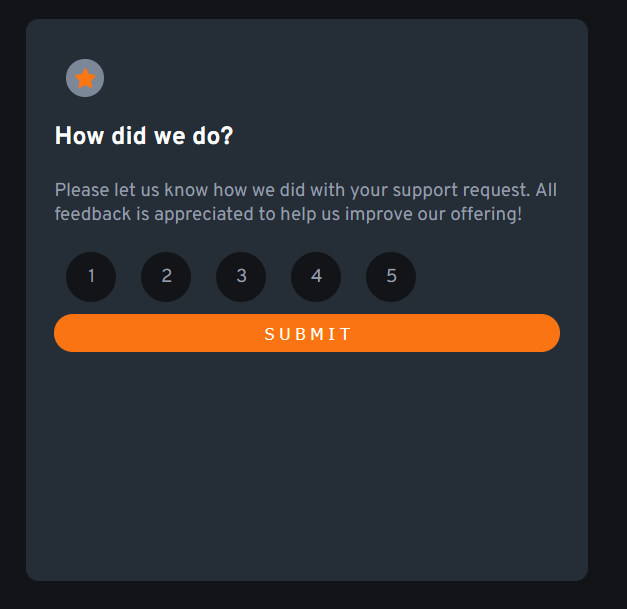

# Frontend Mentor - Interactive rating component solution

This is a solution to the [Interactive rating component challenge on Frontend Mentor](https://www.frontendmentor.io/challenges/interactive-rating-component-koxpeBUmI). Frontend Mentor challenges help you improve your coding skills by building realistic projects.

## Table of contents

- [Frontend Mentor - Interactive rating component solution](#frontend-mentor---interactive-rating-component-solution)
  - [Table of contents](#table-of-contents)
  - [Overview](#overview)
    - [The challenge](#the-challenge)
    - [Screenshot](#screenshot)
    - [Links](#links)
  - [My process](#my-process)
    - [Built with](#built-with)
    - [Useful resources](#useful-resources)
  - [Author](#author)

## Overview

### The challenge

Users should be able to:

- View the optimal layout for the app depending on their device's screen size
- See hover states for all interactive elements on the page
- Select and submit a number rating
- See the "Thank you" card state after submitting a rating

### Screenshot

### Links

- Solution URL: [https://interactive-rating-component-frontendmentor.vercel.app/](https://interactive-rating-component-frontendmentor.vercel.app/)

## My process

### Built with

- HTML
- CSS
- JavaScript

### Useful resources

- [StackOverflow](https://www.stackoverflow.com) - Useful to find solutions to front end problems.

## Author

- Website - [NotReallyEight](https://www.notreallyeight.eu.org)
- Frontend Mentor - [@notreallyeight](https://www.frontendmentor.io/profile/notreallyeight)
- Twitter - [@NotReallyEight](https://www.twitter.com/NotReallyEight)
